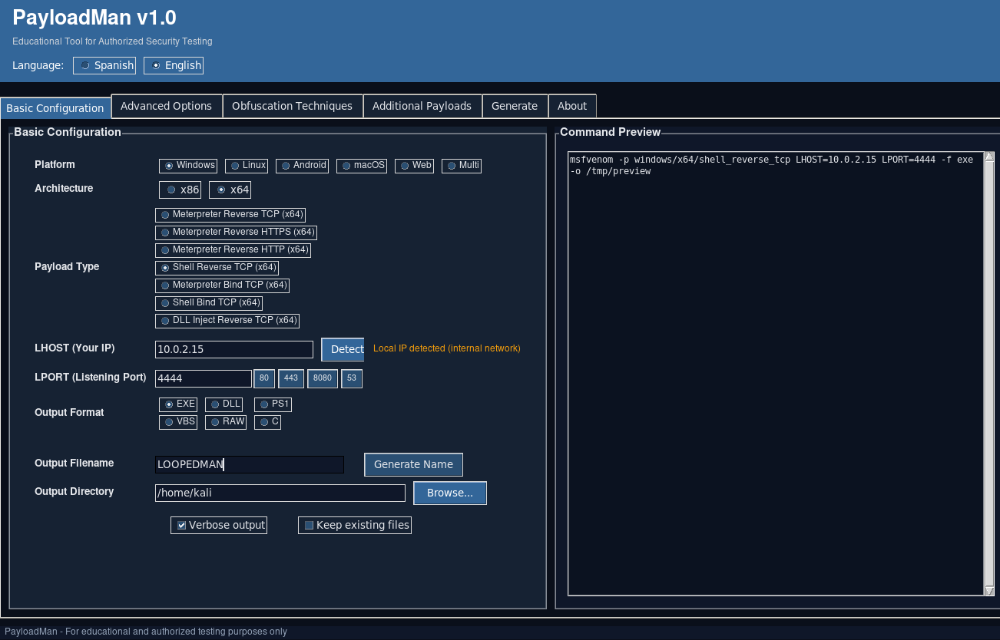
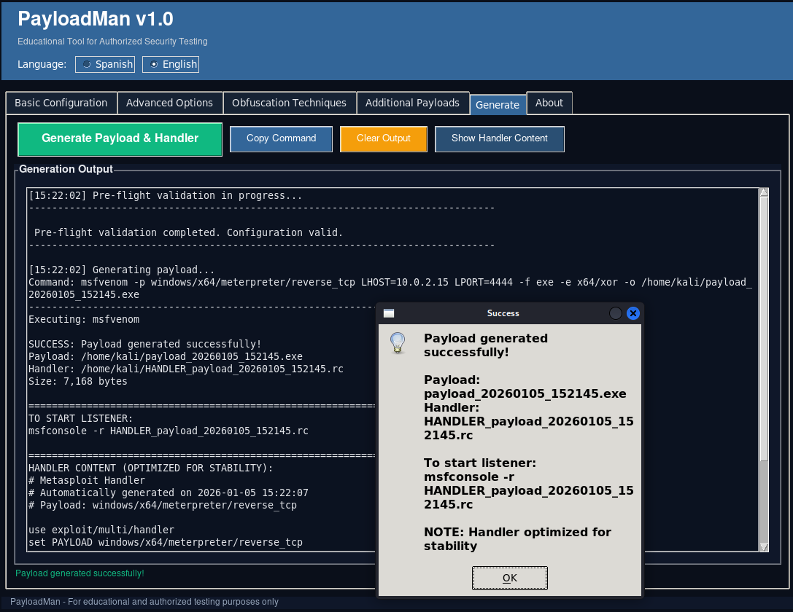

# PayloadMan

PayloadMan is an educational graphical interface for generating Metasploit
(msfvenom) payloads in authorized security testing environments.

It acts as a frontend for `msfvenom`, helping users understand payload options,
formats, platforms, and common constraints in a structured and guided way.

---

## LEGAL DISCLAIMER

This project is intended **strictly for educational purposes and authorized
security testing only**.

You must **NOT** use this software against systems you do not own or do not have
explicit written permission to test.

The author assumes **no responsibility** for misuse, damage, or illegal activity
conducted with this software.  
All actions performed using this tool are the sole responsibility of the user.

By using this software, you agree to comply with all applicable local, national,
and international laws.

---

## What PayloadMan is (and is not)

### ✔ What it IS
- A graphical frontend for `msfvenom`
- An educational tool for learning payload generation
- A helper for understanding platforms, formats, and architectures
- Suitable for labs, CTFs, and authorized penetration testing

### What it is NOT
- It does NOT exploit vulnerabilities
- It does NOT provide zero-days or exploits
- It does NOT bypass security magically
- It does NOT replace Metasploit Framework

---

## Features

- GUI-based payload generation using msfvenom
- Platform-aware payload and format selection
- Architecture awareness (x86 / x64)
- Encoder and bad character configuration
- Warnings for incompatible combinations
- Local caching of msfvenom payloads and formats
- Built-in educational explanations
- No payloads are embedded in the source code

---

## Supported Platforms

- Windows
- Linux
- Android (raw payloads only)
- macOS
- Web (PHP / ASP / JSP)
- Multi-platform payloads

---

## Requirements

- Python 3.x
- Metasploit Framework (msfvenom must be installed and accessible in PATH)
- Authorized testing environment only

---

## Installation

Clone the repository:

```bash
git clone https://github.com/loopedman/PayloadMan.git
cd PayloadMan
```

Run the application:

```bash
python PayloadMan.py
```

---

## Screenshots

### Main Window


### Payload Options


### Generated Payload



## Notes on Usage
PayloadMan does not guarantee payload/encoder compatibility.
Some combinations may fail depending on msfvenom limitations.
Android payloads are generated as raw shellcode and must be integrated manually.
Web formats such as WAR/JAR may require additional packaging steps.
Understanding msfvenom is required to use this tool effectively.

---

## License
This project is licensed under the MIT License.
See the LICENSE file for details.

---

## Author
loopedman
GitHub: https://github.com/loopedman